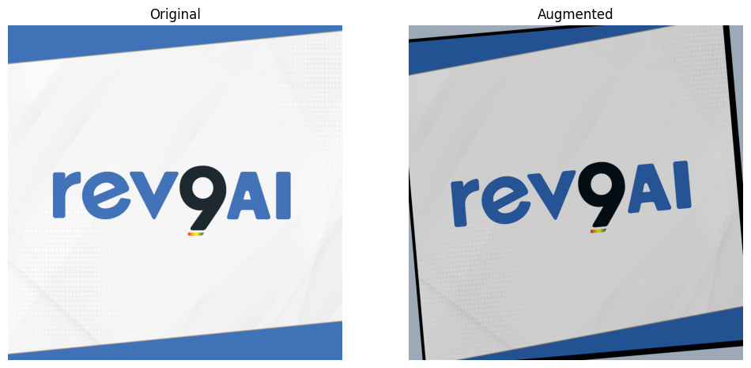

# Augmento: An Image Augmentation Library

Augmento is a Python library that provides a collection of image augmentation techniques for machine learning applications. It offers a wide range of augmentation functions that can help improve the accuracy and robustness of computer vision models by introducing variations to the input data. With Augmento, you can easily incorporate different types of image augmentations in your data pipeline and train more effective models.

The library is designed to be flexible and easy-to-use, with a user-friendly API that allows you to chain together different augmentation functions and customize their parameters to fit your specific use case. Augmento supports a variety of image formats and integrates well with popular machine learning frameworks like PyTorch and TensorFlow.

Whether you're working on a computer vision project, training an object detection algorithm, or building a neural network for image classification, Augmento can help you create more diverse and representative training datasets and improve the performance of your models.

## Installation

To install Augmento, you can use pip, a popular Python package manager. First, ensure that you have pip installed on your system. Then, run the following command:

```shell
pip install augmento
```

This will download and install the latest version of Augmento and its dependencies. Once installation is complete, you can begin using the library in your Python projects.

## Usage

After installation, you can import the `Augmento` class and the desired augmentation classes from the `augmento.augmentations` module.

Here's an example of how to use the `Augmento` class to apply multiple augmentations to an image:

```python
from augmento.augmentations import Colors, Resizing, Rotations
from augmento import Augmento
import cv2

# Load the image
image = cv2.imread("image.jpg")

# Create an instance of the Augmento class
augmentor = Augmento()

# Add augmentations to the pipeline
augmentor.add(augmentation=Colors.jitter())
augmentor.add(augmentation=Resizing.cropper())
augmentor.add(augmentation=Rotations.rotate())

# Apply the augmentations to the image
augmented = augmentor(image)

# Display the augmented image
cv2.imshow("Augmented Image", augmented["image"])
cv2.waitKey(0)
cv2.destroyAllWindows()
```

In the above example, we first loaded an image using OpenCV's `imread()` function. Then we created an instance of the `Augmento` class and added three augmentations to the pipeline using the `add()` method. Finally, we applied the augmentations to the image by calling `augmentor` and displayed the augmented image using OpenCV's `imshow()` function.

You can also apply augmentations to annotations, if provided, by passing them as an additional argument `annotations` in both formats i.e. bounding boxes or points. For bounding boxes, the shape of annotations should be `(n, 4)` with each bounding box as `[x1, y1, x2, y2]` and `(n, 2)` for key-points annotations with each point as `[x1, y1]` where `n` represents number of annotations in an image. 

```python
from augmento.augmentations import Colors, Resizing, Rotations
from augmento import Augmento
import cv2
import numpy as np
import matplotlib.pyplot as plt


# Load the image and annotations
image = cv2.imread("image.jpg")
bboxes = [[500, 1750, 3600, 2650]]

# Create an instance of the Augmento class
augmentor = Augmento()

# Add augmentations to the pipeline
augmentor.add(augmentation=Colors.jitter())
augmentor.add(augmentation=Resizing.cropper())
augmentor.add(augmentation=Rotations.rotate())

# Apply the augmentations to the image and annotations
results = augmentor(image, bboxes)

# Display the augmented image and annotations
fig, plots = plt.subplots(1, 2, figsize=(12, 6))
plots[1].set_title('Augmented')
plots[1].imshow(results['image'])
plots[1].axis('off')
plots[0].set_title('Original')
plots[0].imshow(image)
plots[0].axis('off')
plt.show()
```


## Docs

### Augmento

> Import as `from augmento import Augmento`

The `Augmento` object is the main object of the `augmento` library, which will be used as an image augmentation generator. It accepts a list of augmentation objects and then apply all those augmentations to the input images and annotations by calling it. It could generate a unique image every time based on settings of added augmentations. 

#### Methods

1. `add(augmentation)`

    The `add` method is used to add an augmentation to the `Augmento` generator. It accepts a single argument, which is an instance of an augmentation class such as `Colors.jitter()`, `Resizing.cropper({})`, `Rotations.rotate({})`, etc.
#### Call Augmento Object

To apply the augmentations added in the `Augmento` generator, simply call the generator and it will apply the whole list of augmentations to the input image. It accepts two arguments:

- `image`: The input image to be augmented. The image should be a NumPy array with dimensions `(height, width, channels)`.
- `annotations` _(Optional)_: A 2D array of annotations in either bounding boxes or key-points format. For bounding boxes, the shape of annotations should be `(n, 4)` with each bounding box as `[x1, y1, x2, y2]` and `(n, 2)` for key-points annotations with each point as `[x1, y1]` where `n` represents the number of annotations in an image.

The method returns a dictionary with the following keys:

- `'image'`: The augmented image as a NumPy array with dimensions `(height, width, channels)`.
- `'annotations'`: The augmented annotations (if any) as a numpy array.


### Augmentations

#### Colors

> import as `from augmento.augmentations import Colors`

The `Colors` provides image color augmentation techniques.

1. `jitter(params={})`

    The `jitter` method create color jittering augmentation.

    **Arguments:**
    
    - `params` _(dict)_: A dictionary of parameters for the colors jittering augmentation. The following key-value pairs are accepted:
      - `distribution` _(str, default='normal')_: The type of distribution to use for generating the augmentation values.
      - `add_brightness` _(bool, default=True)_: Whether or not to add brightness augmentation.
      - `brightness_range` _(int, default=50)_: The range of brightness values to use for augmentation.
      - `brightness_value` _(int, default=None)_: A fixed brightness value to use for augmentation. If `None`, then a random value within the range will be chosen.
      - `add_contrast` _(bool, default=True)_: Whether or not to add contrast augmentation.
      - `contrast_range` _(int, default=20)_: The range of contrast values to use for augmentation.
      - `contrast_value` _(float, default=None)_: A fixed contrast value to use for augmentation. If `None`, then a random value within the range will be chosen.
    
    **Returns:**
    
    An instance of the Colors jittering augmentation.

#### Resizing

> import as `from augmento.augmentations import Resizing`

It provides augmentations for image resizing including following:

1. `cropper(params={})`

    Create a cropping augmentation for an input image.
    
    **Arguments**:
    
    - `params`
    
       (dict): A dictionary of parameters for the image cropping. The following key-value pairs are accepted:
    
      - `background` (str, default=None): The path to the background image to use for cropped area. It will work with `keep_within_size=True` and set the specified background for the cropped area.
      - `keep_within_size` (bool, default=True): Whether to keep the output image within the same size as the input image.
      - `cropping_value` (int, default=None): The amount of cropping to apply to the input image. If `None`, then a random cropping value will be set selected from a random normal distribution in the range of 0-360.
    
    **Returns**: 
      
    An instance of the `cropper` augmentation class.

#### Rotations

> import as `from augmento.augmentations import Rotations`

1. `rotate(params={})`:

   The `rotate` method creates a rotation augmentation for an input image. 
   
   **Arguments**:
   
   - `params`
    
       (dict): A dictionary of parameters for the image rotation. The following key-value pairs are accepted:
   
      - `angle` (int, default=None): The angle of rotation in degrees. If None, a random angle between -25 and 25 degrees will be selected.
      - `random_bg` (bool, default=False): Whether to fill the background of the rotated image with a random color.
   
   **Returns**: 

   The `rotate` method returns an instance of the rotation augmentation class, which can be added to an instance of the `Augmento` class for augmenting an image.


#### Flipper

> import as `from augmento.augmentations import Flipper`

1. `horizontal_flip(prob)`:

   The `horizontal_flip` method creates a horizontal flipping augmentation for an input image. 
   
   **Arguments**:
   
   - `prob`
    
       (float): A value between 0 and 1 for the probability of applying this augmentation. Default value is `1.0` that means it will apply flipping augmentation to each image.
   
   **Returns**: 

   The `horizontal_flip` method returns an instance of the horizontal flipping augmentation class.
2. `vertical_flip(prob)`:

   The `vertical_flip` method creates a vertical flipping augmentation for an input image. 
   
   **Arguments**:
   
   - `prob`
    
       (float): A value between 0 and 1 for the probability of applying this augmentation. Default value is `1.0` that means it will apply flipping augmentation to each image.
   
   **Returns**: 

   The `vertical_flip` method returns an instance of the vertical flipping augmentation class.


#### AffineTransformer

> import as `from augmento.augmentations import AffineTransformer`

1. `with_padding(scale_range, shift_range)`:

   The `with_padding` method creates an affine transformation augmentation with keeping the padding area in the canvas for an input image. 
   
   **Arguments**:
   
   - `scale_range`

     (tuple): Range for image scaling. Default is `(0.8, 1.2)` i.e. the augmentation will select any random value between this range for scaling image.
   - `shift_range`: Range for image shifting inside the canvas. Default value is `(-0.1, 0.1)` i.e. the augmentation will select any random value between this range and move the image accordingly. 
   
   **Returns**: 

   The `with_padding` method returns an instance of the affine transformation augmentation class.

2. `without_padding(scale_range, shift_range)`:

   The `without_padding` method creates an affine transformation augmentation and remove the padding area. In other words, it will enable the scaling+cropping behaviour and every image generated by this augmentation could be in different image sizes. 
   
   **Arguments**:
   
   - `scale_range`

     (tuple): Range for image scaling. Default is `(0.8, 1.2)` i.e. the augmentation will select any random value between this range for scaling image.
   - `shift_range`: Range for image shifting inside the canvas. Default value is `(-0.1, 0.1)` i.e. the augmentation will select any random value between this range and move the image accordingly. 
   
   **Returns**: 

   The `without_padding` method returns an instance of the affine transformation augmentation class.

## Examples

First, let's import the necessary classes and libraries:

```python
from augmento.augmentations import Augmento, Colors, Rotations
import cv2
import numpy as np
```

Then, let's load the image and its corresponding annotations:

```python
image_path = 'path/to/image.jpg'
annotation_path = 'path/to/annotations.npy'

# Load the image
image = cv2.imread(image_path)

# Load the annotations
annotations = np.load(annotation_path)
```

Next, let's create an instance of the `Augmento` class and add the desired augmentations:

```python
# Create an instance of the Augmento class
augmentor = Augmento()

# Add color jittering augmentation
augmentor.add(augmentation=Colors.jitter())

# Add rotation augmentation
augmentor.add(augmentation=Rotations.rotate(params={'angle': 45}))
```

Now, we can apply the augmentations to the image and annotations

```python
# Apply the augmentations
augmented = augmentor(image, annotations)
```

That's it! You have successfully applied color jittering and rotation augmentation to an image with annotations using the `augmento` library.